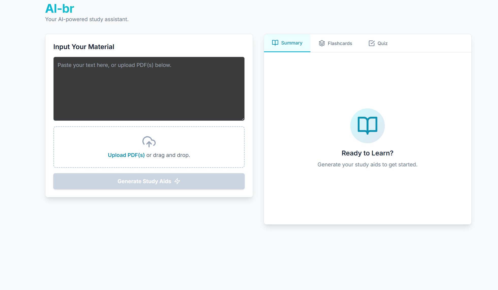

# AI Study Assistant (AI-br)

AI-br is a powerful, web-based study assistant designed to help students and learners transform their notes, articles, or documents into effective study materials. By leveraging the Google Gemini API, this application automatically generates summaries, flashcards, and quizzes from user-provided text or PDF files.




## ✨ Features

-   **Versatile Input:** Paste raw text directly or upload one or more PDF documents. The app intelligently extracts and combines the text for processing.
-   **AI-Generated Content:** At the click of a button, the app generates a complete set of study aids:
    -   **📝 Summaries:** Get a concise and well-structured summary of the key points and concepts from your material.
    -   **🃏 Interactive Flashcards:** Review key terms and definitions with a smooth, flipping card interface.
    -   **🧠 Multiple-Choice Quizzes:** Test your understanding with a dynamically generated quiz. Questions and options are shuffled for each attempt.
    -   **💡 Next Steps:** Receive intelligent suggestions for topics to explore further, helping you deepen your knowledge.
-   **User-Friendly Interface:**
    *   A clean, responsive, and intuitive UI built with Tailwind CSS.
    *   A tabbed layout to easily switch between the summary, flashcards, and quiz.
    *   Loading states and error handling to provide clear user feedback.
    *   Drag-and-drop support for PDF uploads.

## 🛠️ Tech Stack

-   **Frontend:** [React](https://react.dev/), [TypeScript](https://www.typescriptlang.org/)
-   **Styling:** [Tailwind CSS](https://tailwindcss.com/)
-   **AI Model:** [Google Gemini API](https://ai.google.dev/) (`@google/genai`)
-   **PDF Processing:** [PDF.js](https://mozilla.github.io/pdf.js/)

## 🚀 How It Works

1.  **Input:** The user pastes text or uploads PDF files through the UI in `TextInputArea.tsx`.
2.  **Processing:** If PDFs are uploaded, the `pdfService.ts` uses PDF.js to extract the text content.
3.  **API Call:** The extracted text is sent to the `geminiService.ts`. This service constructs a detailed prompt and a response schema.
4.  **Generation:** A request is made to the Gemini API (`gemini-2.5-flash` model). The model processes the text based on the prompt and returns a structured JSON object containing the summary, flashcards, quiz questions, and next steps.
5.  **Rendering:** The `App.tsx` component receives the JSON data, updates its state, and passes the data down to the relevant components (`SummaryView.tsx`, `FlashcardView.tsx`, `QuizView.tsx`) to be rendered in the UI.

## 📂 Project Structure

```
.
├── components/         # Reusable React components
│   ├── FlashcardView.tsx
│   ├── Icons.tsx
│   ├── Loader.tsx
│   ├── ProgressTracker.tsx
│   ├── QuizView.tsx
│   ├── StudyAidsTabs.tsx
│   ├── SummaryView.tsx
│   └── TextInputArea.tsx
├── services/           # Logic for external services
│   ├── geminiService.ts  # Handles all interactions with the Gemini API
│   └── pdfService.ts     # Handles PDF text extraction
├── App.tsx             # Main application component
├── index.html          # Entry point HTML file
├── index.tsx           # React root renderer
├── metadata.json       # Application metadata
└── types.ts            # TypeScript type definitions
```

## 🔐 API Key

This application requires a Google Gemini API key to function. The key is expected to be available as an environment variable `process.env.API_KEY`. The application is configured to read this variable directly for security and convenience.

### Prerequisites

You will need to have [Node.js](https://nodejs.org/en/) (version 14 or later) and a package manager like `npm` or `yarn` installed.

### Installation & Setup

1.  **Clone the repository to your local machine:**
    ```sh
    git clone https://github.com/BenazizaAbdelkaderRiyadh/ai-study-assistant.git
    ```
2.  **Navigate to the project directory:**
    ```sh
    cd ai-study-assistant
    ```
3.  **Install the necessary dependencies:**
    ```sh
    npm install
    ```
4.  **Run the development server:**s
    ```sh
    npm run dev
    ```